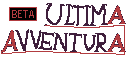
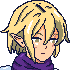

<br />
<div align="center">
  <a href="https://github.com/Soe18/CuddlyCat_Inc">
	<!-- Logo lì sotto -->
	
  </a>

  <h3 align="center"> Ultima avventura </h3>

  <p align="center">
	Project Work n.1 proposto da AddValue (2023/2024).
	<br />
	<a href="https://docs.google.com/document/d/1eLS9_0iRqGVQaYs2AbrhKNqSjsCHx-kBfcf0UvqqUeU/edit?usp=drive_link"><strong>Visualizza Documentazione »</strong></a>
	<br />
	<br />
	<a href="https://github.com/Soe18/ultima_avventura/releases">Scarica il gioco</a>
	·
	<a href="https://github.com/soe18/ultima_avventura/issues">Segnala un problema</a>
  </p>
</div>

## In breve
Ultima avventura è un gioco rpg a turni il quale obiettivo è quello di sopravvivere per più round affrontando diversi tipi di boss. I punti vita e il mana dei personaggi non aumenteranno a fine di ogni combattimento.

<!-- Metti table of contents -->
## Contenuti
- [Il gioco](#il-gioco)
	+ [Trama](#trama)
	+ [Azioni](#azioni)
	+ [Scopri i personaggi](#scopri-i-personaggi)
	+ [Tecnologie utilizzate](#tecnologie-utilizzate)
- [Scaricare e installare](#scaricare-e-installare)
- [Modding](#modding)
- [Crediti](#crediti)

## Il gioco
### Trama
Un grupp**o** di avventurieri in missi**o**ne si ritr**o**va in una apparente stanza del tes**o**r**o**. Alla vista di un en**o**rme tes**o**r**o**, il gi**o**vane mag**o** dai capelli vi**o**la del grupp**o** è intrepid**o** ad aprirl**o**, ma n**o**n si acc**o**rge della trapp**o**la. Appena il baule viene apert**o**, tutti c**o**l**o**r**o** che si ritr**o**van**o** nella stanza veng**o**n**o** spediti in un’altra dimensi**o**ne. Veng**o**n**o** p**o**rtati nel n**o**str**o** m**o**nd**o**, s**o**ltant**o**… en**o**rmemente ridimensi**o**nati. **O**ra s**o**n**o** alti quant**o** un**o** sc**o**iatt**o**l**o** e dev**o**n**o** tr**o**vare un m**o**d**o** di t**o**rnare indietr**o**. Eventualmente n**o**n ce la farann**o** mai, in quant**o** il gi**o**c**o** andrà avanti all’infinit**o** e sarann**o** quindi c**o**stretti, prima **o** p**o**i, a m**o**rire. Vivi la l**o**r**o** ultima avventura.

### Azioni
All'avvio, ci si ritroverà nella seguente schermata:

Avviando il gioco, queste saranno le opzioni possibili:

### Scopri i personaggi
<table>
  <tr>
	<th>Arata</th>
	<th>Asphile</th>
	<th>Kan</th>
  </tr>
  <tr>
	<td>
  	<div align="center">
    	
  	</div>
	</td>
	<td>
  	<div align="center">
    	
  	</div></td>
	<td>
  	<div align="center">
    	
  	</div>
	</td>
  </tr>
  <tr>
	<td>Mago promettente che conosce magie di offesa e di supporto. Sarà sempre nella mente del giocatore perché sarà l’anello vitale del gruppo che se cadrà potrebbe destinare l’intero gruppo al fallimento inesorabile.</td>
	<td>Elfa guerriera con lo spirito di gruppo. Permette al giocatore di garantire al gruppo di rimanere al sicuro e di avere opportunità di attacco. Da sola non sarà in grado di fare molto.</td>
	<td>Giovane stregone che permette di effettuare attacchi devastanti rendendo il pacing del gioco più rapido. La sua perdita porterà a rendere i singoli incontri lunghi e, lentamente, a portare uno svantaggio sempre più elevato.</td>
  </tr>
</table>

### Tecnologie utilizzate
* Godot: <br>
Game engine utilizzato per lo sviluppo del videogioco. Utilizzata l'ultima versione di Godot per la produzione (v. 4.2.2).
* Piskel: <br>
Pixel art editor che consente di creare animazioni e assets grafici.

## Scaricare e installare
Nella voce [releases](https://github.com/Soe18/ultima_avventura/releases) sono contenuti tutti i file necessari per il download.

> :warning: **Consiglio prima di continuare di prestare attenzione all'audio del proprio dispositivo!**

### Windows
Scaricare il file ultima_avventura_win.zip da [releases](https://github.com/Soe18/ultima_avventura/releases) (o premere [qui](https://github.com/Soe18/ultima_avventura/releases/download/v0.9.0/ultima_avventura_win.zip)) ed estrarre il file.<br>
Avviare ultima_avventura.exe

### Linux
Scaricare il file ultima_avventura_linux.zip da [releases](https://github.com/Soe18/ultima_avventura/releases) (o premere [qui](https://github.com/Soe18/ultima_avventura/releases/download/v0.9.0/ultima_avventura_linux.zip)) ed estrarre il file.<br>
Rendere eseguibile ed eseguire il file ultima_avventura.x86_64:

> :warning: **Se il dispositivo non supporta Vulkan, seguire la procedura da terminale.**

- #### Attraverso il File Manager:<br>
  + solitamente facendo tasto destro o andando a controllare nei permessi, selezionare la spunta per **Consentire l'esecuzione del file come programma**.
  + Eseguire ultima_avventura.x86_64 facendo doppio click (o nelle metodologie usate dal File Manager).
- #### Attaverso il Terminale:
  + incollare il seguente comando nel terminale nella stessa directory di ultima_avventura.x86_64:
  ```console
  $ chmod 755 ultima_avventura.x86_64
  $ ./ultima_avventura.x86_64
  ```
  + Eseguire ultima_avventura.x86_64 con questo comando, sempre nella stessa directory:
  ```console
  $ ./ultima_avventura.x86_64
  ```
  **In caso si registri un errore che contiene nel messaggio di errore:**
  ```console
  $ ERROR: Could not initialize Vulkan
  ```
  Eseguire il file con questo comando:
  ```console
  $ ./ultima_avventura.x86_64 --rendering-driver opengl3
  ```

## Modding
Ultima Avventura non è ultimato, ma è stato tenuto in considerazione fin dagli albori del progetto di tenere il gioco altamente modificabile.<br>
La sua natura [FOSS](https://it.wikipedia.org/wiki/Free_and_Open_Source_Software) permette di modificare il titolo pesantemente e molto più facilmente.<br>
Verrà rilasciata una guida in futuro per "Come modificare Ultima Avventura", in quanto il gioco è ancora in modalità **BETA**.

## Crediti
Grazie a Daniel Linssen per il font utilizzato: [m5x7](https://managore.itch.io/m5x7).
Grazie ad AddValue per l'occasione offerta.
